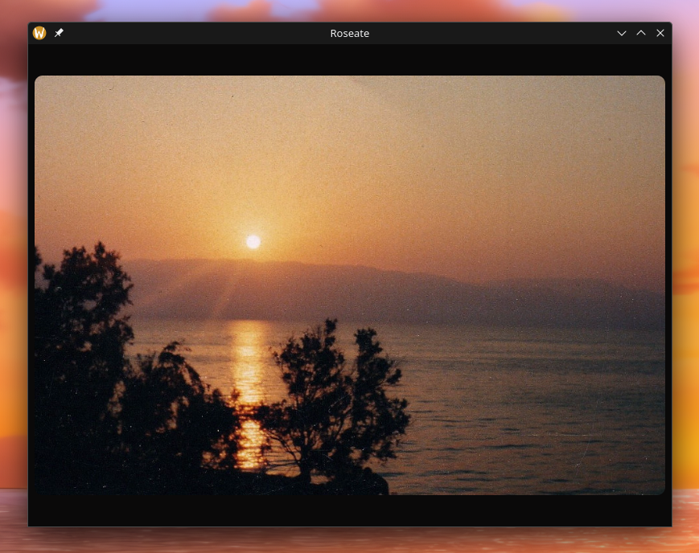

<div align="center">

  # 🌹 roseate
  <sub>A fast as fuck, memory efficient and simple but fancy image viewer built with Rust that's cross-platform. **VERY WIP!**</sub>

  

  <sub>(image from a WIP development build, this is **NOT** the final product)</sub>

</div>

> [!CAUTION]
> This project is HEAVILY a work in progress, hence it may crash or harm your system. Github issues are very welcome. 🤝

# 🌟 Devlogs
<a href="https://www.youtube.com/watch?v=8bSdw34x98k&list=PLI8mjQYZec82ZajoDnDkAicBarEZ1yPd-&index=2">
  
</a>

You can find devlogs **in video format** on my youtube channel; I have a playlist for it here: **https://www.youtube.com/playlist?list=PLI8mjQYZec82ZajoDnDkAicBarEZ1yPd-**

# 🛠️ Installation
As Roseate is in heavy development I won't offer packages and binaries yet so you'll need to compile the application from source.

## 🏗 Build from source
### Prerequisites:
- [Rust](https://www.rust-lang.org/tools/install) and Cargo (Rust **`1.80.0`**+ is required!).

- Linux dependencies required by [eframe](https://crates.io/crates/eframe):
  - [libxcb](https://archlinux.org/packages/extra/x86_64/libxcb/)
  - [libxkbcommon](https://archlinux.org/packages/extra/x86_64/libxkbcommon/)
  - [openssl](https://archlinux.org/packages/core/x86_64/openssl/)
- [libxrandr](https://archlinux.org/packages/extra/x86_64/libxrandr/) (required by [display-info](https://crates.io/crates/display-info) for smart downsampling)
- [xdg-desktop-portal](https://github.com/flatpak/xdg-desktop-portal) (required by [rfd](https://docs.rs/rfd/latest/rfd/) for file dialog)

All of these deps are required on Linux. However they are *common* x11 / wayland dependencies so you most likely already have them installed.

1. Clone the repo.
```sh
git clone https://github.com/cloudy-org/roseate
cd roseate
```
2. Pull the cirrus tool kit submodule.
```sh
git submodule update --init --recursive
```

#### 🎀 Install into your system.
Installing it to your system I advise you use GNU Make or else copy the commands from the "[Makefile](./Makefile)" (you will need to install Make if you haven't already).
If you would like to run roseate for development continue ahead to the [next section](#%EF%B8%8F-for-development).

3. Build the release binary.
```sh
make
```
4. Install to your system.
```sh
sudo make install
```
5. Then the `roseate` binary will be available in your terminal.
```sh
roseate
```

Open an image by passing its path.
```sh
roseate ./anime_girls.png
```
You might want to also set the binary at ``/usr/bin/roseate`` as your default image viewer so double clicking on images calls it. 
You can look up how to perform that for your desktop environment or operating system but on many popular Linux desktop environments, the [`roseate.desktop`](https://github.com/cloudy-org/roseate/blob/main/assets/roseate.desktop) file that is now installed on your system is your friend. 😉

#### ⚙️ For Development
> [!WARNING]
> Building a development build WILL SIGNIFICANTLY KILL performance! Always

Now for development, you would just run ``cargo run``.

3. Run dev binary.
```sh
cargo run
```
To run Roseate in development with an image, append `--` and pass an image path after like so:
```sh
cargo run -- ./anime_girl.png
```
To run with verbose debugging, call cargo run with the `RUST_LOG=DEBUG` environment variable:
```sh
RUST_LOG=DEBUG cargo run -- ./anime_girl.png
```
```
[2024-10-20T02:20:36Z DEBUG roseate] Image '/home/goldy/Downloads/anime_girl.png' loading from path...
[2024-10-20T02:20:36Z DEBUG eframe] Using the glow renderer
[2024-10-20T02:20:36Z DEBUG sctk] Bound new global [70] wl_output v4
[2024-10-20T02:20:36Z DEBUG sctk] Bound new global [74] wl_output v4
[2024-10-20T02:20:36Z DEBUG sctk] Bound new global [30] zxdg_output_manager_v1 v3
[2024-10-20T02:20:36Z DEBUG sctk] Bound new global [10] wl_seat v7
[2024-10-20T02:20:36Z DEBUG sctk] Bound new global [16] wp_cursor_shape_manager_v1 v1

... (truncated for the sanity of this readme)
```

<br>

<div align="center">

  

</div>
