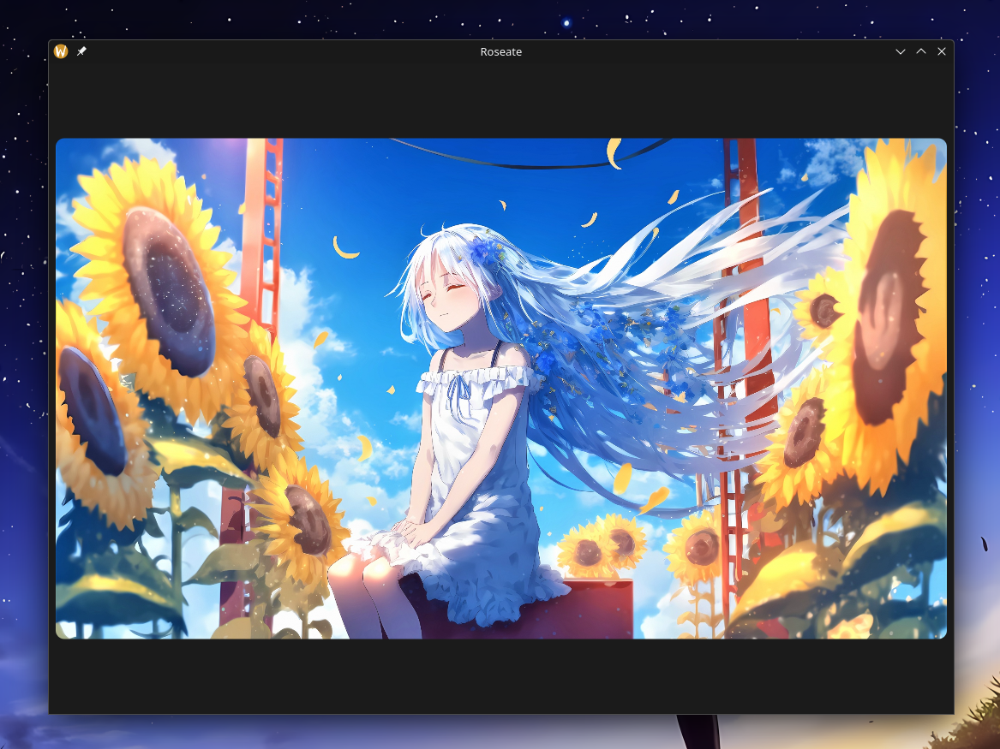

<div align="center">

  # 🌹 roseate
  <sub>A small and simple but fancy image viewer built with Rust that's cross-platform. **VERY WIP!**</sub>

  

  <sub>(image from a WIP development build, this is **NOT** the final product)</sub>

</div>

> [!CAUTION]
> This project is HEAVILY a work in progress, hence it may crash or harm your system. Github issues are very welcome. 🤝

# 🛠️ Installation
As Roseate is in heavy development I won't offer packages and binaries yet so you'll need to compile the application from source.

## 🏗 Build from source
### Prerequisites:
- [Rust](https://www.rust-lang.org/tools/install) and Cargo (I used **`1.80.0`** for development).

1. Clone the repo.
```sh
git clone https://github.com/cloudy-org/roseate
cd roseate
```
~~2. Pull some submodules.~~
```sh
git submodule update --init --recursive
```
**(you can skip that step as the cirrus toolkit is not needed right now)**

#### ⚙️ For Development
At this stage, for development, you would just run ``cargo run``. If you would like to install it to your system continue ahead to the [next section](#-install-to-your-system).

4. Run dev binary.
```sh
cargo run
```
To run Roseate in development with an image, append `--` and pass an image path after like so:
```sh
cargo run -- ./anime_girl.png
```

#### 🎀 Install into your system.
Installing it to your system I advise you use GNU Make or else copy the commands from the "[Makefile](./Makefile)" (you will need to install Make if you haven't already).

4. Build the release binary.
```sh
make
```
5. Install to your system.
```sh
sudo make install
```
6. Then the `roseate` binary will be available in your terminal.
```sh
roseate
```

Open an image by passing its path.
```sh
roseate ./anime_girls.png
```
You might want to also set the binary at ``/usr/bin/roseate`` as your default image viewer so double clicking on images calls it. You can look up how to perform that for your desktop environment or OS.