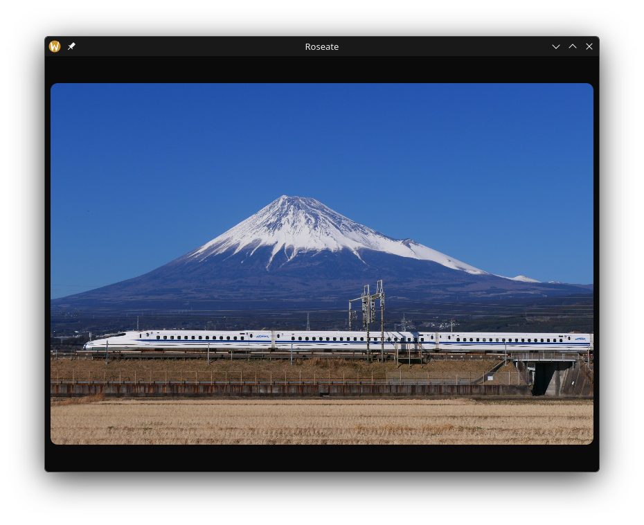
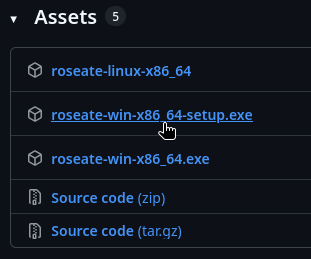

<div align="center">

  # 🌹 roseate
  <sub>A fast, GPU-accelerated image viewer built for simplicity and customisation. **WIP!**</sub>

  

  <sub>Screenshot from an alpha build, this is **NOT** the final product - **[Image Credit](https://commons.wikimedia.org/wiki/File:Series-N700a-Mt.Fuji.jpg)**</sub>

</div>

> [!CAUTION]
> Roseate is still **work in progress** and in alpha, loading some images could crash or freeze up your system.
> Bug reports via GitHub issues are very welcome. 🤝
> 
> As we're in alpha, many little features I intend to be available on a stable release, either don't exist yet or are unfinished.
> PRs for unassigned issues or issues labelled with "good first issue" are welcome. 🤝
> 
> An AI policy for cloudy-org hasn't been laid out yet, hence until our AI policies are official expect me to **reject** AI generated code, PRs and issues.
> 
> Thank you!

**Roseate** is a **free** and **open-source**, GPU accelerated, cross-platform and simplistic but modern looking image viewer seeking to become highly configurable and fast.

```toml
[image.optimizations]
# The optimisation mode controls and defines how 
# images are loaded and managed within the image viewer.
# 
# Balanced: A decent balance between low memory usage and speed (the default).
# 
# Speed: You don't mind higher memory usage and just want images to load as fast as possible.
# 
# Quality: You don't care about memory usage, you just want the highest quality and sharpest image possible.
mode = "balanced"
```

*..when a beta is ready there will be some images here demonstrating Roseate's speed...*

UI is also very customisable, here's a **very** small snippet:


Supported image formats are currently:
- **PNG**
- **JPEG**
- **GIF**
- **WEBP**
- **QOI**
- **BMP**
- **ICO**
- **TIFF**

..and more with currently limited support to be worked on. You can see them in the **[Supported Image Formats](https://cloudy-org.github.io/wiki/apps/roseate/supported_formats/)** wiki page.
More formats will be supported as releases drop.

# 📖 Wiki
Moving forward the wiki will provide more in-depth information: **https://cloudy-org.github.io/wiki/apps/roseate**

- **[What is Roseate?](https://cloudy-org.github.io/wiki/apps/roseate/#roseate)**
- **[How do I use Roseate?](https://cloudy-org.github.io/wiki/apps/roseate/how_to_use/)**
- **[Why did you make an image viewer?](https://cloudy-org.github.io/wiki/apps/roseate/#background)**

# 🛠️ Installation
Roseate is in heavy development so you won't see many packages and binaries offered, you'll mostly need to compile the application from source.

> [!warning]
> Roseate is in **ALPHA**, expect bugs during installation on some platforms.

## 🪟 Windows
Head over to [github releases](https://github.com/cloudy-org/roseate/releases) and grab a windows installer from the latest alpha release in assets.



## 🐧 Linux
First check your linux distribution for available packages.

If there isn't any, either grab the binary from the releases or compile from source.

[](https://repology.org/project/roseate/versions)

### Arch Linux
I officially maintain both **[`roseate`](https://aur.archlinux.org/packages/roseate)** and **[`roseate-bin`](https://aur.archlinux.org/packages/roseate-bin)** on the **Arch Linux** AUR:

```sh
yay -S roseate-bin
```

## 🏗️ Build from source

### Prerequisites:
- **[Rust](https://www.rust-lang.org/tools/install)** and **Cargo** (Rust **`1.89.0`**+ is required!).
- **Linux** (dependencies required by **[eframe](https://crates.io/crates/eframe)**, you most likely already have all of these installed)
  - **[libxcb](https://archlinux.org/packages/extra/x86_64/libxcb/)**
  - **[openssl](https://archlinux.org/packages/core/x86_64/openssl/)**
  - **[libxkbcommon](https://archlinux.org/packages/extra/x86_64/libxkbcommon/)**
  - **[xdg-desktop-portal](https://github.com/flatpak/xdg-desktop-portal)**

Ignore all deps under "Linux" if you're not on **Linux**.

1. Clone the repository and pull git submodules.
```sh
git clone https://github.com/cloudy-org/roseate
cd roseate

# latest tagged version
git checkout v0.1.0-alpha.26

git submodule update --init --recursive
```

2. Build the release binary.
```sh
cargo build --release
```

3. The binary is located at `./target/release`.

If you're on **Linux** there is a handy `make install` command to install the compiled binary, the **`.desktop` file** and **icons** into your system as well as `make uninstall`:

```sh
sudo make install
```

# 💽 Development
> [!NOTE]
> Building a development build WILL SIGNIFICANTLY KILL performance!
> Read more [here](https://github.com/cloudy-org/roseate/blob/6e7e638997110af0149f06ceadb87c3ec088cf84/Cargo.toml#L48-L53).

For development, you would just run ``cargo run``.

```sh
cargo run
```

To run Roseate in development with an image, append `--` and pass an image path after like so:

```sh
cargo run -- ./anime_girl.png
```

To run with verbose debugging, call cargo run with the `RUST_LOG=DEBUG` environment variable:

```sh
RUST_LOG=DEBUG cargo run -- ./anime_girl.png
```
```
[2024-10-20T02:20:36Z DEBUG roseate] Image '/home/goldy/Downloads/anime_girl.png' loading from path...
[2024-10-20T02:20:36Z DEBUG eframe] Using the glow renderer
[2024-10-20T02:20:36Z DEBUG sctk] Bound new global [70] wl_output v4
[2024-10-20T02:20:36Z DEBUG sctk] Bound new global [74] wl_output v4
[2024-10-20T02:20:36Z DEBUG sctk] Bound new global [30] zxdg_output_manager_v1 v3
[2024-10-20T02:20:36Z DEBUG sctk] Bound new global [10] wl_seat v7
[2024-10-20T02:20:36Z DEBUG sctk] Bound new global [16] wp_cursor_shape_manager_v1 v1

... (truncated for the sanity of this readme)
```

<br>

<div align="center">

  

</div>
