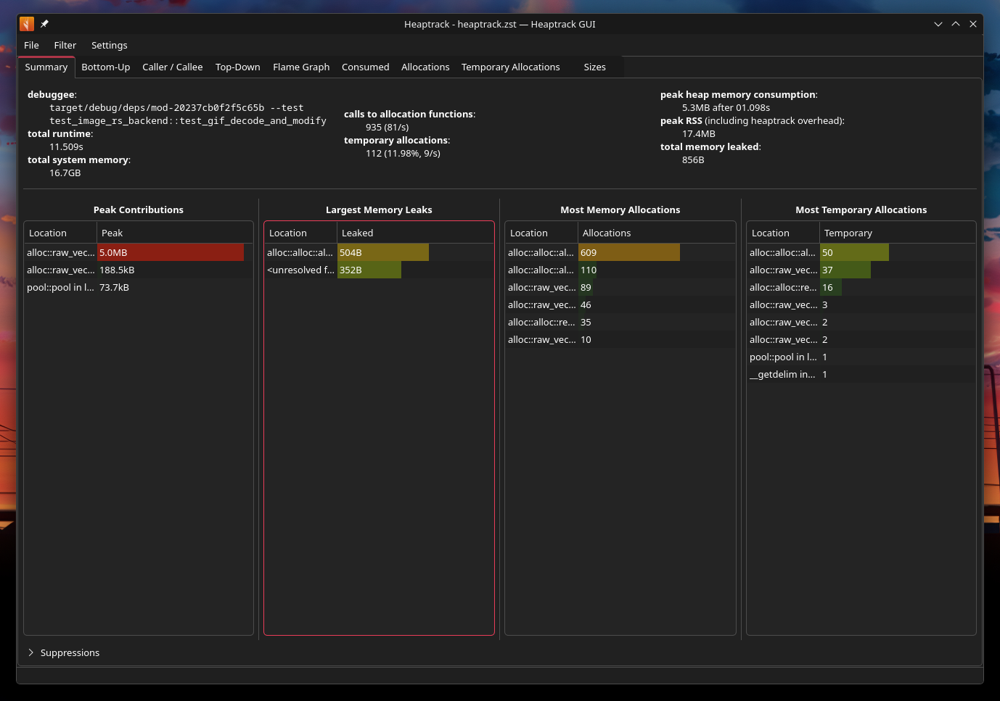

<div align="center">

  # roseate-core

</div>

Little guide before as a reminder to myself on how to profile memory on individual roseate-core unittests.

## How to profile memory of a unittest (for debugging purposes).


You can run individual unittests with cargo via a command like:
```
cargo test test_image_rs_backend::test_animated_png_decode_and_modify
```

To profile the memory in an individual test we can use [`heaptrack`](https://github.com/KDE/heaptrack) from KDE. However we'll need the direct binary file to use this.

Before running with heaptrack, first run a normal cargo test to build everything and ensure all tests pass beforehand:
```
cargo test
```
> Running this in the root of the directory will also run tests from cirrus and the roseate app but it will be followed by roseate-core eventually so it's fine.

We can use the `cargo test --no-run` command to get the path to the binary.

```
    Finished `test` profile [unoptimized + debuginfo] target(s) in 0.27s
  Executable unittests src/lib.rs (target/debug/deps/cirrus_config-bdc6a5df08d08b70)
  Executable unittests src/lib.rs (target/debug/deps/cirrus_egui-cb0a691ee1a178a3)
  Executable unittests src/lib.rs (target/debug/deps/cirrus_error-9e73505d9111a34f)
  Executable unittests src/lib.rs (target/debug/deps/cirrus_path-b7eab0a4b117fde6)
  Executable unittests src/lib.rs (target/debug/deps/cirrus_theming-805d0df610d33dc4)
  Executable unittests src/main.rs (target/debug/deps/roseate-3b198d6f2d0b4c92)
  Executable unittests src/lib.rs (target/debug/deps/roseate_core-045fdaa6ec4f57b5)
  Executable tests/mod.rs (target/debug/deps/mod-20237cb0f2f5c65b)
```

We're looking at the last one (`target/debug/deps/mod-20237cb0f2f5c65b`).

Now that we have the binary we can use it to run our individual test (`test_image_rs_backend::test_animated_png_decode_and_modify`) with `heaptrack`:

```
heaptrack --output /tmp/heaptrack target/debug/deps/mod-20237cb0f2f5c65b --test test_image_rs_backend::test_animated_png_decode_and_modify
```

A heaptrack window will open if heaptrack has been installed with a GUI.